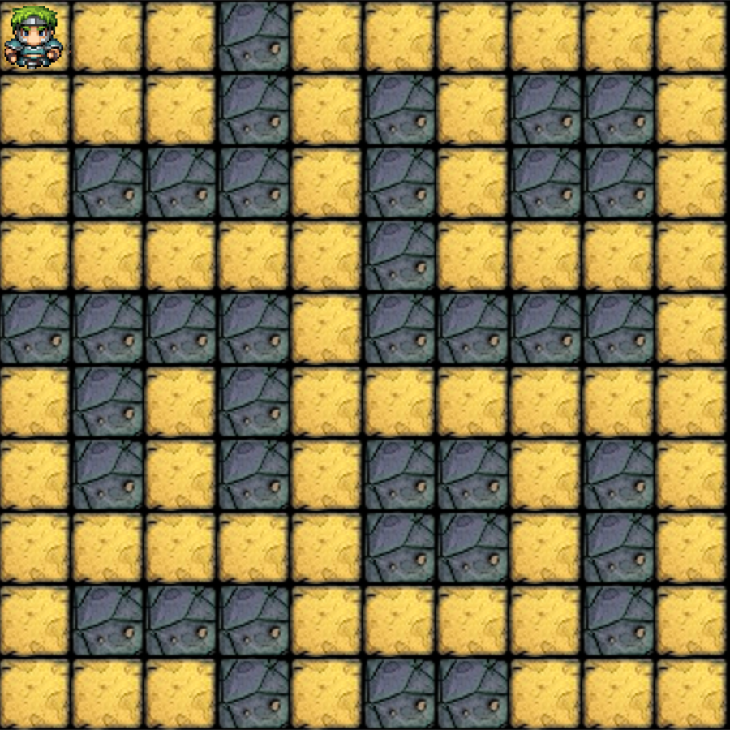

# Celotýdenní projekt: Wanderer - RPG hra

### [Boiler](boilder.md)

Vytvořte hru, kde hrdina chodí po dlaždicích a zabíjí monstra. Hrdina je ovládán v bludišti pomocí klávesnice. Hrdina i monstra mají úrovně a statistiky, které závisí na jejich úrovni. Cílem je dosáhnout nejvyšší úrovně tím, že porazíte monstra, která mají klíče k dalším úrovním.

## Proč?

Hlavním cílem projektu je procvičovat objektově orientované myšlení. Nejlepší způsob, jak si to procvičit, je vytvořit větší aplikaci a přemýšlet o její architektuře. Toto je jedna z prvních příležitostí, kdy učeň vytváří architekturu, takže se na této úrovni očekávají problémy. Není nutné přijít s dobře navrženou architekturou, ale spíše začít o ní přemýšlet.

Zatímco učeň přemýšlí o architektonických problémech, procvičuje všechny základní stavební bloky představené během úvodní fáze.

Poskytujeme pouze vysoce úrovňové popisy funkcí a učeň musí sám vytvořit explicitní instrukce pro implementaci.

Toto je jeden z prvních větších projektů, které musí učeň dodat. V předchozích projektech jsme představili metodu kanban. Toto je skvělá příležitost procvičit si kanban ve větším měřítku. Prosím, dodržujte principy a ukažte svou práci mentorovi k revizi, než budete mít více než 2 úkoly ve sloupci "doing".

## Workshop: Naplánujte si práci

### 1. Projděte si specifikaci projektu

#### Herní obrazovka

- Obrazovka obsahuje první oblast, která je tvořena 10 x 10 dlaždicemi, na kterých se může pohybovat hrdina (a monstra).
    - Každá oblast obsahuje 10 x 10 dlaždic.
- Existují dlaždice, které nemohou být obsazeny žádnou postavou (hrdinou ani monstrem).
- Každá oblast obsahuje 3-6 monster.
- Úrovně monster odpovídají číslu oblasti.
    - Pokud se jedná o X-tou oblast, monstra mají úroveň X (s 50% pravděpodobností) nebo úroveň X+1 (40%) nebo úroveň X+2 (10%).
- Jedno z monster je boss.
- Jedno z monster (není to boss) má klíč, takže pokud je zabito, hrdina přejde do další oblasti, ale také musí být zabit boss.
- Herní obrazovka také obsahuje textovou oblast, kde jsou zobrazovány informace o postavách.
    - Zobrazuje všechny statistiky hrdiny.
    - Pokud je hrdina na stejné dlaždici jako monstrum, zobrazuje také všechny statistiky monstra.

#### Pohyb

- Hrdina se může pohybovat po dlaždicích v čtyřech směrech pomocí šipek (nebo "WASD" pokud preferováno).
- Po každém druhém pohybu hrdiny se monstra pohybují o jednu dlaždici také.

#### Postavy

- Každá postava má (maximální a aktuální) zdravotní body (HP), obranné body (DP) a útočné body (SP).
- Tyto hodnoty se mohou během hry měnit.
- Když zdravotní body postavy dosáhnou 0 nebo méně, je mrtvá.
    - Zmizí z oblasti.
    - Pokud jde o hrdinu, je to konec hry.

#### Počáteční statistiky

(d6 je náhodné číslo mezi 1 a 6, tedy hod 6-stěnnou kostkou)

- Hrdina:
    - HP: 20 + 3 \* d6
    - DP: 2 \* d6
    - SP: 5 + d6
- Monstrum Úrovně X:
    - HP: 2 \* X \* d6
    - DP: X/2 \* d6
    - SP: X \* d6
- Boss Úrovně X:
    - HP: 2 \* X \* d6 + d6
    - DP: X/2 \* d6 + d6 / 2
    - SP: X \* d6 + X

#### Boj

- Když hrdina vstoupí na dlaždici, kterou obývá monstrum, začíná boj.
- Postava, která vstoupí na obsazenou dlaždici, je útočník.
- Když hráč stiskne `mezerník`, jeho hrdina udeří na obránce a poté obránce udeří zpět.
- Útoky se střídají, dokud jedna z postav nezemře.
- Po vyhraném boji, pokud je postava hrdina, zvyšuje svou úroveň.

#### Útok

- Hodnota útoku (SV) se počítá z SP a d6 zdvojeného.
- Útok je úspěšný, pokud 2 \* d6 + SP je vyšší než DP druhé postavy.
- Při úspěšném útoku jsou zdravotní body druhé postavy sníženy o hodnotu SV - DP druhé postavy.

#### Levelování

- Po úspěšně vyhraném boji se postava leveluje.
- Jeho maximální HP se zvýší o d6.
- Jeho DP se zvýší o d6.
- Jeho SP se zvýší o d6.

#### Vstup do další oblasti

- Po zabití monstra, které drží klíč k další oblasti, hrdina okamžitě vstupuje do další.
    - Tato oblast je podobná předchozí, ale s novými a silnějšími monstry.
- Po vstupu do nové oblasti má hrdina:
    - 10% šanci obnovit všechny své HP.
    - 40% šanci obnovit třetinu svých HP.
    - 50% šanci obnovit 10% svých HP.
- Monstrum Úrovně X:
    - HP: 2 \* X \* d6
    - DP: X / 2 \* d6
    - SP: X \* d6

### 2. Přečtěte si [uživatelské příběhy](stories.md)

### 3. Forkněte si repozitář projektu

#### [Java](https://github.com/green-fox-academy/wanderer-java)

#### [C#](https://github.com/green-fox-academy/wanderer-cs)

#### [TypeScript](https://github.com/green-fox-academy/wanderer-typescript)

#### [C++](https://github.com/green-fox-academy/wanderer-cpp)
