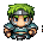

# Úvod

*Příběhy by měly být následovány implementací. Dokončení příběhu znamená, že jste
v projektu udělali malý pokrok.*

*Pamatujte, že musíte vyvinout celou hru. Takže když pracujete na konkrétním
příběhu, měli byste být schopni implementaci znovu použít později v jiných
částech hry.*

## Vykreslete obrazovku s dlaždicemi

### 1. Nakreslete jednu dlaždici

- Po spuštění hry
- Měla by se zobrazit dlaždice jako tato:

| Podlahová dlaždice             |
|--------------------------------|
|  |

### 2. Zaplňte obrazovku dlaždicemi

- Po spuštění hry
- Měla by se zobrazit mapa dlaždic jako tato:

### 3. Přidejte dlaždice zdí

- Po spuštění hry
- Když je mapa vykreslena na obrazovce
- Měly by se zobrazit dlaždice podlahy i zdí podobně jako na tomto rozložení
  (zdi můžete uspořádat jinak, pokud chcete):

| Podlahová dlaždice             | Dlaždice zdi                 |
|--------------------------------|------------------------------|
|  |  |

## Umístěte postavu a ovládejte ji pomocí kláves

### 4. Přidejte Hrdinu

- Po spuštění hry
- Když je mapa vykreslena na obrazovce
- Přidejte hráčskou postavu zvanou Hrdina
- Měla by se zobrazit hrdina v levém horním rohu:

| Hrdina                     |
|----------------------------|
|  |

## Interakce

Hráč by měl být schopen pohybovat hrdinou pomocí šipek na klávesnici.

### 5. Pohyb

- Po spuštění hry
- Když hráč stiskne *jakoukoli* klávesu se šipkou
- Hrdina by se měl pohnout daným směrem

### 6. Směr Hrdiny

- Po spuštění hry
- Když se hrdina pohybuje pomocí šipek
- Hrdina by měl být natočen směrem, kterým se pohybuje

| Hrdina Nahoru                 | Hrdina Vpravo                    | Hrdina Dolu                   | Hrdina Vlevo                   |
|-------------------------------|----------------------------------|-------------------------------|--------------------------------|
|  |  |  |  |

### 7. Hrany mapy

- Pokud je hrdina na jakémkoli okraji mapy
- Když se hráč pokusí hrdinu posunout směrem k okraji
- Neměl by se pohnout ani opustit mapu, pouze by se měla změnit jeho orientace, pokud je to nutné

### 8. Zdi

- Pokud je hrdina vedle dlaždice zdi
- Když se hráč pokusí hrdinu posunout směrem k této zdi
- Neměl by se pohnout, pouze by se měla změnit jeho orientace, pokud je to nutné

## Rozšíření o různé typy postav

### 9. Kostlivci

- Po spuštění hry
- Když je mapa vykreslena na obrazovce
- Měly by se na mapě objevit 3 kostlivci na podlahových dlaždicích

| Kostlivec                            |
|--------------------------------------|
|  |

### 10. Boss

- Po spuštění hry
- Když je mapa vykreslena na obrazovce
- Na mapě by měl být boss na nějaké podlahové dlaždici

| Boss                         |
|------------------------------|
|  |

## Vytvořte HUD, soubojový a herní systém

### 11. Statistiky

- Po spuštění hry
- Když je mapa vykreslena na obrazovce
- Pod mapou by se měly zobrazit statistiky v bílém rámečku jako černý text
    - Mělo by zahrnovat:
        - Úroveň Hrdiny
        - Aktuální HP (*zdravotní body*) Hrdiny
        - Maximální HP Hrdiny
        - DP (*obranné body*) Hrdiny
        - SP (*útočné body*) Hrdiny
    - Například: `Hrdina (Úroveň 1) HP: 8/10 | DP: 8 | SP: 6`

### 12. Útok

- Postavy mohou útočit podle detailů ve
  [specifikaci](project.md#Útok)

### 13. Soubojová logika

- Po útoku hrdiny by se obránce měl vrátit úder stejným způsobem

### 14. Další oblast

- Když je zabit nepřítel s klíčem, hrdina by měl automaticky vstoupit do nové úrovně

## Volitelné funkce

### 15. Aktualizace postav při pohybu hrdiny

- Ostatní postavy by se měly pohnout pouze při pohybu hrdiny

### 16. Náhodná mapa

- Když se vytvoří mapa, rozmístění zdí by mělo být náhodné
- Zajistěte, aby všechny podlahové dlaždice byly propojené

### 17. Levelování

- Přidejte více HP / poškození hrdinovi podle specifikace
- Přidejte více HP / poškození monstrům
- Implementujte náhodné události, které se stanou při vstupu do nové oblasti

### 18. Pohyb monster

- Monstra by se měla pohybovat bez ohledu na to, zda se hráč hrdinou pohybuje nebo ne
- Zrychlete jejich pohyb s každou úrovní
